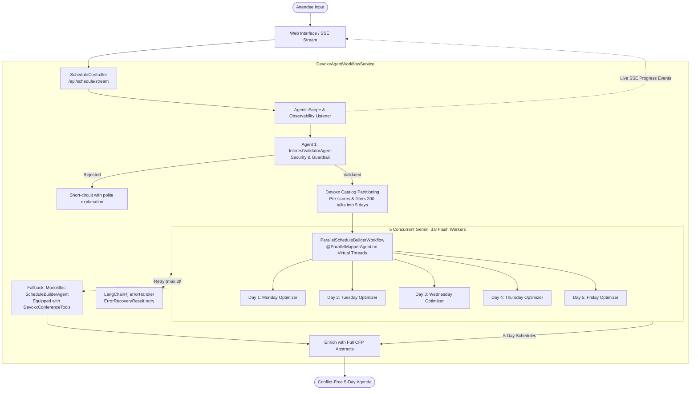

# Devoxx Belgium 2026 AI Schedule Curator (`dvxaisched`)

A modern Java 25 & Micronaut application that leverages **LangChain4j's Agentic Framework** and Google's **Gemini 3.8 Flash** (`gemini-3.8-flash`) to generate personalized, conflict-free, 5-day conference schedules for [Devoxx Belgium 2026](https://devoxx.be) (October 5–9, 2026 at Kinepolis Antwerp).

---

## Architecture & Agent Structure

The application is structured as a resilient, multi-stage agentic pipeline built with LangChain4j (`langchain4j-agentic` and `langchain4j-google-genai`).



### 1. Agent 1: Guardrail & Validator (`InterestValidatorAgent`)
- **Role:** Security and relevance guardrail.
- **Safety checks:**
  - Evaluates user input against **prompt injection** and jailbreaks (`DAN`, instruction overrides, system prompt exfiltration).
  - Flags insults, profanity, harassment, or completely meaningless gibberish.
  - Verifies relevance to software engineering, cloud, architecture, developer culture, and technology.
- **Outcome:** Produces a structured `ValidationResult`. If rejected, it immediately short-circuits the pipeline with a friendly explanation, saving LLM tokens and execution time.

### 2. Fast Catalog Partitioning & Pre-Indexing
- Before dispatching LLM calls, the service scores and pre-filters candidate talks from the 200 official Devoxx Belgium sessions against the attendee's validated interests.
- Sessions are partitioned across the 5 distinct conference days according to Devoxx formatting rules (e.g. Deep Dives and Labs on Mon/Tue; Keynotes, Lunch talks, and Conference sessions on Wed/Thu/Fri).

### 3. Agent 2: Parallel Day Mapper (`ParallelScheduleBuilderWorkflow`)
- **Role:** Concurrently synthesizes conflict-free daily agendas.
- **Parallel Mapper:** Uses LangChain4j's `@ParallelMapperAgent` mapped across **Java 25 virtual threads** (`Executors.newVirtualThreadPerTaskExecutor()`).
- **Sub-Agent (`DayScheduleBuilderAgent`):** 5 concurrent Gemini 3.8 Flash workers each curate a single conference day:
  - Selects 3 to 6 top sessions matching attendee interests.
  - Strictly enforces no overlapping time slots.
  - Generates personalized curation rationales for each session.
- **Performance Impact:** Reduces end-to-end synthesis time from ~45–60 seconds down to ~10–15 seconds by processing all 5 days simultaneously.

### 4. Resilient Error Handling (`errorHandler`)
- Configured with LangChain4j's native **`errorHandler`** on the parallel mapper builder.
- **Granular Retries:** If a single day worker fails due to transient API rate limits or network issues, the handler intercepts the error and issues **`ErrorRecoveryResult.retry()`** up to 2 times for that specific day, without discarding the other 4 completed days.
- **Progress Visibility:** Emits informative retry progress updates to the live UI.

### 5. Multi-Tier Fallback Safety Net
- **Tier 1:** Monolithic `ScheduleBuilderAgent` equipped with `DevoxxConferenceTools` (tool calling for session search, tracks, and favorites) runs if parallel mapping fails.
- **Tier 2:** Deterministic catalog fallback if LLM services are completely unreachable.

### 6. Live Observability & Streaming SSE
- Implements LangChain4j's `AgentListener` (`beforeAgentInvocation`, `afterAgentInvocation`, `beforeAgentToolExecution`, `afterAgentToolExecution`).
- Hooks into `AgenticScope` and streams live progress events via Server-Sent Events (`/api/schedule/stream`) to render animated status cards in the web frontend.

---

## Tech Stack

- **Runtime & Language:** Java 25 (OpenJDK 25) with virtual threads
- **Backend Framework:** Micronaut 5.1.5 (Netty HTTP server, Serde JSON, Project Reactor)
- **Agentic AI:** LangChain4j `1.20.0-beta30` (`langchain4j-agentic`, `langchain4j-google-genai`)
- **LLM:** Google Gemini 3.8 Flash (`gemini-3.8-flash`)
- **Cloud Infrastructure:** Google Cloud Run (Serverless build-less container execution) & Google Secret Manager
- **Automation:** Gradle 9.6 + `just` task runner

---

## Prerequisites

- **JDK 25** (e.g. installed via [SDKMAN!](https://sdkman.io/)): `sdk install java 25-tem`
- **Gemini API Key:** from [Google AI Studio](https://aistudio.google.com/)
- **`just`** (optional, recommended for quick commands): `brew install just`
- **Google Cloud SDK (`gcloud`)** (for deployment): `brew install --cask google-cloud-sdk`

---

## Local Development & Running

Set your Gemini API key:

```bash
export GEMINI_API_KEY="your-gemini-api-key"
```

### Using `just` (Recommended)

```bash
# Run the application locally (port 8080)
just run

# Run all unit and integration test suites
just test

# Package shadow fat JAR and stage for deployment
just build

# Fetch the latest Devoxx BE 2026 schedule from CFP API
just fetch

# See all available commands
just
```

### Using `./gradlew`

```bash
# Run locally
./gradlew run

# Run tests
./gradlew test

# Build fat JAR
./gradlew shadowJar

# Fetch latest schedule from CFP API
./gradlew fetchSchedule
```

Once started, open your browser:
- **Interactive Web UI:** [http://localhost:8080/](http://localhost:8080/)
- **Health Check:** [http://localhost:8080/api/health](http://localhost:8080/api/health)
- **Official Tracks:** [http://localhost:8080/api/tracks](http://localhost:8080/api/tracks)

---

## Fetching Latest Conference Schedules (`fetchSchedule`)

The application embeds the official Devoxx Belgium 2026 dataset in [`src/main/resources/devoxx-be-2026.json`](file:///Users/glaforge/Projects/dvxaisched/src/main/resources/devoxx-be-2026.json).

A custom Gradle task queries the public Devoxx CFP REST API (`https://dvbe26.cfp.dev/api/public`), normalizes timezones (`Europe/Brussels`), merges speaker bios and full abstracts, sorts talks chronologically, and updates the local resources:

```bash
# Via just
just fetch

# Via Gradle
./gradlew fetchSchedule

# Or fetch for a specific event slug (e.g. dvbe25)
just fetch dvbe25
```

---

## Deployment to Google Cloud Run

The application is deployed to Google Cloud Run using the **build-less Java 25** source deployment approach (`google-24/java25`), which avoids Cloud Build overhead and completes in ~15 seconds.

### Deploying via `just`

```bash
# Deploy with default project (genai-java-demos) and region (europe-west1)
just deploy

# Deploy to a custom GCP project and region
just project=my-company-project region=us-central1 deploy

# Check deployed service status and URL
just status

# View live Cloud Run logs
just logs
```

### Manual Deployment via `gcloud`

```bash
# 1. Package fat JAR into build-less staging directory
./gradlew shadowJar
mkdir -p build/run && cp build/libs/dvxaisched-0.1-all.jar build/run/application.jar

# 2. Deploy to Cloud Run
gcloud beta run deploy dvxaisched \
    --source=build/run \
    --base-image=google-24/java25 \
    --region=europe-west1 \
    --project=genai-java-demos \
    --no-build \
    --set-secrets=GEMINI_API_KEY=GEMINI_API_KEY:latest \
    --set-env-vars=MICRONAUT_SERVER_PORT=8080 \
    --memory=2Gi \
    --cpu=2 \
    --allow-unauthenticated \
    --quiet
```

---


## License

This project is licensed under the [Apache License, Version 2.0](LICENSE).

---

## Disclaimer

This is not an official Google project. It is not an officially supported Google product.


